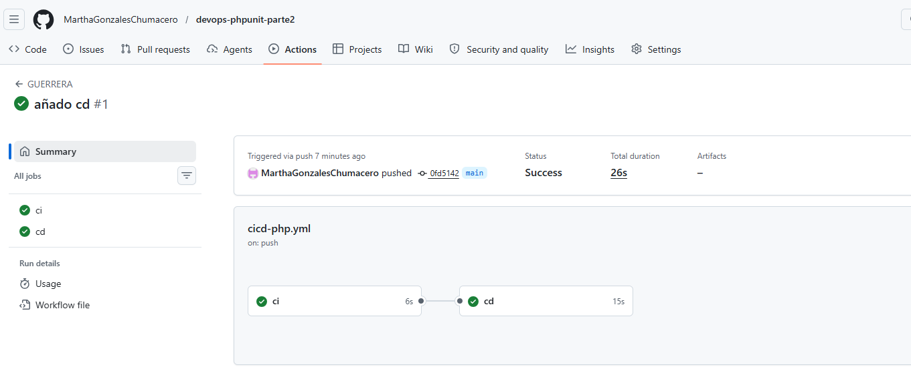
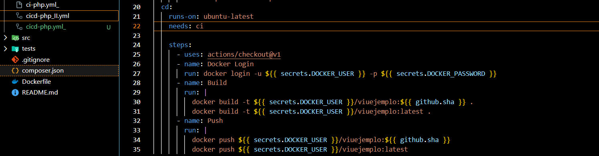
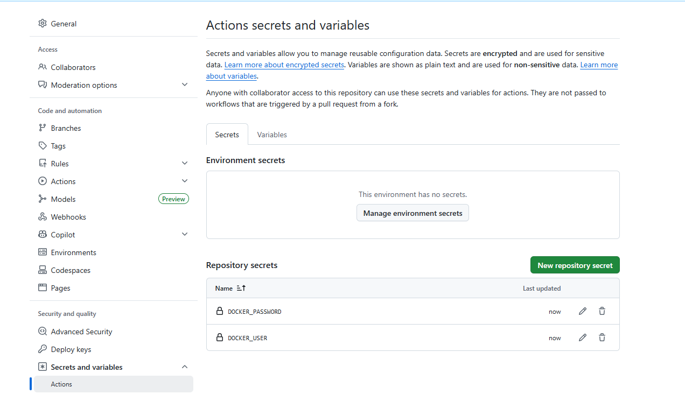
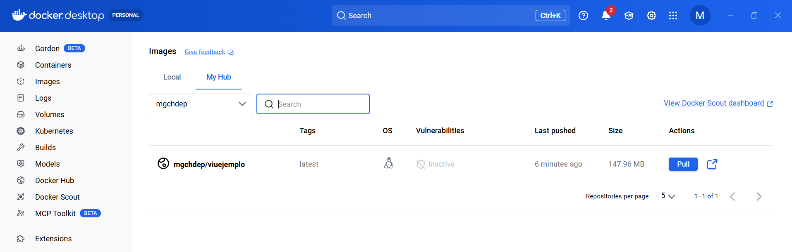
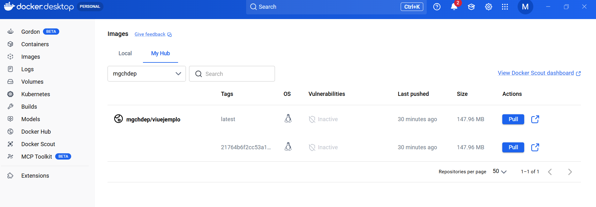

# DevOps PHPUnit Parte 2 - GitHub Actions y Docker Hub

## Descripción

En esta segunda parte de la práctica se trabajó con integración continua (CI) y despliegue continuo (CD) utilizando PHP, PHPUnit, GitHub Actions y Docker Hub.

El objetivo fue automatizar la ejecución de pruebas unitarias y la publicación de imágenes Docker mediante workflows configurados en GitHub Actions.

---

## Tecnologías utilizadas

- PHP
- PHPUnit
- Docker
- Docker Hub
- GitHub
- GitHub Actions
- Visual Studio Code

---

## Clonación del repositorio

Se clonó el repositorio proporcionado en el seminario:

```bash
git clone https://github.com/VicenteMonfort/VIU-github-actions-php-phpunit.git
```

Luego se ingresó al proyecto:

```bash
cd VIU-github-actions-php-phpunit
```

Y se abrió en Visual Studio Code:

```bash
code .
```

---

## Configuración de GitHub Actions

Dentro de `.github/workflows` se trabajó con workflows YAML.

Inicialmente algunos archivos estaban deshabilitados mediante `_` al final del nombre:

```text
ci-php.yml_
```

Posteriormente se activó el workflow principal utilizando:

```text
cicd-php.yml
```

Esto permitió ejecutar automáticamente los procesos CI/CD desde GitHub Actions.

---

## Workflow CI/CD

El workflow configurado contiene las etapas de:

- CI (Continuous Integration)
- CD (Continuous Deployment)

Se utilizó:

```yaml
needs: ci
```

Esto permite que el despliegue continuo dependa primero de la validación correcta de las pruebas unitarias.

---

## Integración Continua (CI)

Se configuró un workflow para:

- instalar dependencias,
- ejecutar PHPUnit,
- validar automáticamente los tests del proyecto.

Cada vez que se realizó un `push`, GitHub Actions ejecutó automáticamente las pruebas unitarias.

### Evidencia CI/CD



---

## Despliegue Continuo (CD)

Se configuró el workflow para:

- realizar login en Docker Hub,
- construir imágenes Docker,
- subir automáticamente la imagen al repositorio Docker Hub.

### Configuración del workflow



---

## Configuración de Secrets

En GitHub se configuraron los siguientes Secrets:

| Secret | Descripción |
|---|---|
| DOCKER_USER | Usuario de Docker Hub |
| DOCKER_PASSWORD | Contraseña de Docker Hub |

Estos Secrets fueron utilizados por GitHub Actions para autenticarse automáticamente en Docker Hub.

### Secrets configurados



---

## Docker Hub

Se verificó la subida automática de imágenes Docker al repositorio:

```text
mgchdep/viuejemplo
```

La imagen fue publicada correctamente mediante GitHub Actions.

### Imagen publicada en Docker Hub



### Tags generados automáticamente en Docker Hub

En Docker Hub se generaron automáticamente múltiples tags para la imagen del proyecto.

El tag:

```text
latest
```

representa la versión más reciente de la imagen Docker.

Además, GitHub Actions generó automáticamente un tag adicional asociado al hash del commit realizado en GitHub. Esto permite mantener trazabilidad y versionamiento automático de las imágenes generadas durante el proceso CI/CD.

Esto demuestra que el pipeline automatizado construyó y publicó correctamente múltiples versiones de la imagen Docker.



---

## Flujo CI/CD implementado

```text
GitHub → GitHub Actions → Docker Hub
```

Proceso automatizado:

1. Push al repositorio.
2. Ejecución automática de pruebas PHPUnit.
3. Construcción automática de imagen Docker.
4. Publicación automática en Docker Hub.

---

## Resultados obtenidos

- Configuración correcta de GitHub Actions.
- Integración continua funcionando.
- Despliegue continuo funcionando.
- Ejecución automática de pruebas PHPUnit.
- Publicación automática de imágenes Docker.
- Automatización básica DevOps implementada correctamente.

---
